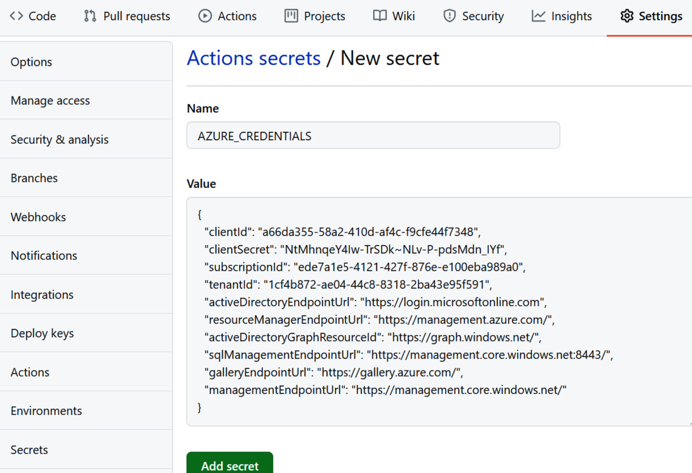

# GItHub CICD with AKS and MCR

## CI
1. Create resource group
   az group create --name rg-akshandson --location eastus2
   
2. Create MCR - name needs to be globally unique and all lowercase
   az acr create -n harrchenhandsonacr -g rg-akshandson --sku Basic

3. Create AKS
   az aks create -g rg-akshandson -n akshandson  --enable-managed-identity --network-plugin azure --node-vm-size Standard_DS2_v2   --node-count 2 --generate-ssh-keys

4. Attach MCR to AKS
   az aks update -n akshandson -g rg-akshandson --attach-acr harrchenhandsonacr
5. 
6. Create Service Principal
   az ad sp create-for-rbac --name "akscicd" --sdk-auth --role contributor

   Copy the entire json output

7. Add the above output as GitHub repository secret
   

8. 
9.  Create a new pipeline.  The working copy is located at .github/workflows/pipeline.yml

## CD
 